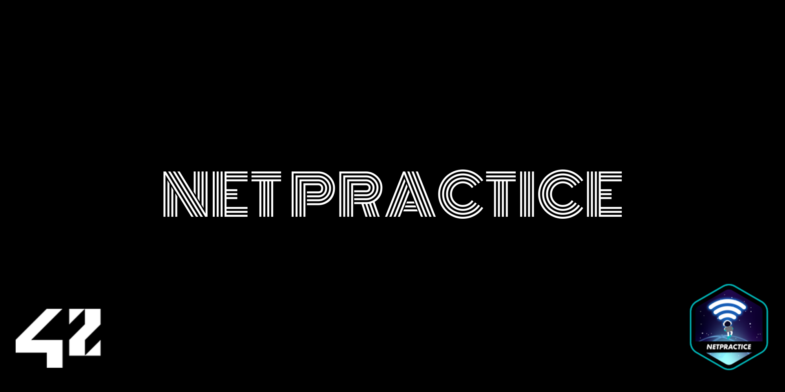
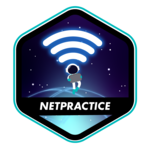

# NetPractice

Welcome to **NetPractice**, a unique and challenging project designed to introduce the fundamentals of computer networking. Unlike traditional coding projects, **NetPractice** focuses on understanding and solving networking problems using TCP/IP, subnetting, and routing principles. This hands-on journey deepens your knowledge of how networks operate and communicate.

---

## About

**NetPractice** is a practical exercise aimed at solving networking challenges. Using a browser-based interface, you’re tasked with configuring small-scale virtual networks to make them operational. The project progressively introduces key networking concepts, requiring you to:

- **Understand IP Addressing:** Learn how IP addresses, subnet masks, and CIDR notation define networks and hosts.
- **Configure Subnets:** Divide large networks into smaller subnets to efficiently allocate IP addresses.
- **Work with Routers & Switches:** Understand their roles in directing network traffic and connecting devices.
- **Set up Routing Tables:** Define paths for data packets between networks using next-hop addresses.

By the end of this project, you’ll have a practical understanding of TCP/IP networking and the ability to troubleshoot and configure basic network setups.

---

## Challenges & Learnings

### Challenges
1. **TCP/IP Addressing:**  
   Deciphering how IP addresses and subnet masks define the boundaries of networks and hosts.

2. **Subnetting:**  
   Splitting larger networks into smaller, logically separated networks to optimize address allocation.

3. **Routing & Packet Flow:**  
   Configuring routing tables to ensure packets are delivered correctly across multiple networks.

4. **Switches & Routers:**  
   Understanding how switches handle communication within a network and how routers connect separate networks.

5. **Troubleshooting Logs:**  
   Analyzing logs to identify misconfigurations and correct them systematically.

---

### Key Concepts
- **TCP/IP Protocol Suite:**  
  The backbone of modern networking, ensuring data is transmitted reliably between devices.

- **IP Addressing:**  
  Logical addressing for devices in a network, including IPv4 addressing schemes and private/public IP ranges.

- **Subnet Masks & CIDR Notation:**  
  Defining networks and determining the range of valid host addresses.

- **Routing Tables:**  
  Configuring routes to direct packets to their destination, including default routes for unknown destinations.

- **Switches & Routers:**  
  - Switches enable communication between devices within the same network.
  - Routers connect multiple networks and use routing tables to manage data flow.

---

## Getting Started

1. **Understanding the Interface:**  
   NetPractice is a browser-based training platform. Each level presents a broken network diagram that must be configured to meet specific goals.

2. **Solving Levels:**  
   - Configure devices (routers, switches, and hosts) by assigning appropriate IP addresses and subnet masks.
   - Adjust routing tables to ensure data packets flow correctly between networks.
   - Use logs to troubleshoot and verify configurations.

3. **Progressive Learning:**  
   The project consists of 10 levels, each introducing new challenges:
   - **Level 1-3:** Focus on basic IP addressing and subnetting.
   - **Level 4-6:** Introduce routing concepts and connecting multiple networks.
   - **Level 7-10:** Combine subnetting, routing, and advanced concepts like overlapping ranges and internet connections.

4. **Simulating Real Networks:**  
   While the networks in NetPractice are virtual, the configurations mimic real-world scenarios, making it an ideal tool for learning and practicing networking fundamentals.

---

## Reflection

NetPractice is an excellent way to bridge the gap between theory and practical application in networking. By working through these levels, you gain valuable insights into how devices communicate, how data is routed across networks, and how to identify and resolve issues effectively. This project serves as a foundation for anyone interested in network administration or system-level troubleshooting.

---

**Thank you for exploring NetPractice!**  
I hope this README inspires you to dive deeper into the fascinating world of networking. 🌐
